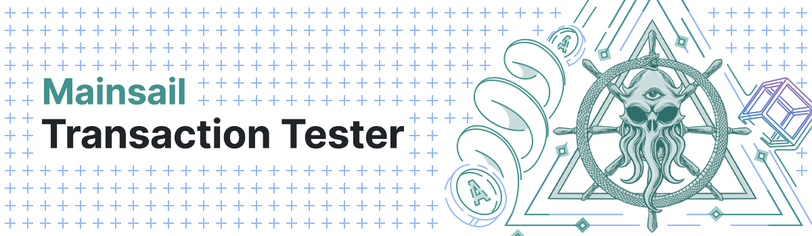

# Mainsail Tx Tester



## Prerequisits

Ensure that you have a working `python` binary in your PATH as this script compiles native crypto bindings (specifically https://github.com/ChainSafe/blst-ts will cause you issues). If you notice that you run into an error while installing the dependencies and one of the lines in the stack trace includes `/bin/sh: python: command not found`, this is your issue. A [known scenario](https://github.com/ChainSafe/blst-ts/issues/87) where this happens is on later macOS versions where only a `python3` binary is present.

To resolve it, make sure `python` is available on your system. One way to easily manage this is by using a Python version manager such as [`pyenv`](https://github.com/pyenv/pyenv).

<!-- ## Yarn

### Installation

```bash
yarn
yarn build
```

### Usage

Show help:

```bash
yarn start
```

Send TX:

```bash
yarn start <TX number>
```

Generate wallets **Mnemonic**, **Address** and **Public Key**:

```bash
yarn wallet
```

```bash
yarn wallet "custom mnemonic"
```

Generate validator **Private**- and **Public Key**:

```bash
yarn validator
```

```bash
yarn validator "custom mnemonic"
``` -->

## Requirements

Ensure Mainsail repos is installed on the same parent directory and is build from `evm` branch.

Layout:

```
some_dir/
   mainsail/
   mainsail-tx-tester/
```

**Checkout additional package that are required to build Mainsail. [Link](https://docs.ihost.org/docs/mainsail/installation/source)**

Commands:

```bash
// Setup mainsail
git clone https://github.com/ArkEcosystem/mainsail.git
cd mainsail
git checkout evm
pnpm run setup


// Setup mainsail-tx-tester
cd ..
git clone https://github.com/ArkEcosystem/mainsail-tx-tester.git
cd mainsail-tx-tester
git checkout evm
pnpm i
pnpm run build
```

## PNPM

### Installation

```bash
pnpm i
pnpm run build
```

### Usage

Show help:

```bash
pnpm run start
```

Send TX:

```bash
pnpm run start <TX number>
```

Generate wallets **Mnemonic**, **Address** and **Public Key**:

```bash
pnpm run wallet
```

```bash
pnpm run wallet "custom mnemonic"
```

Generate validator **Private**- and **Public Key**:

```bash
pnpm run validator
```

```bash
pnpm run validator "custom mnemonic"
```

## Configuration

Look into `/config/config.js` file.

Provide correct **peer** data that have enabled Public API and Transaction Pool API.

Default configuration is using testnet from [Mainsail Network Config](https://github.com/ArkEcosystem/mainsail-network-config/tree/main/testnet/mainsail). Use correct **plugins** and **crypto** that is used in the `app.json` and `crypto.json` on the target network.

Adjust `senderPassphrase` and transaction data (recipientId, fee, amount) before sending TX.

## Note

TX Sender is using the Public API to obtain the wallet nonce and Transaction Pool API to send the transaction. Make sure that target node have both APIs enabled.

## Check transactions

```bash
curl --location --request GET 'http://127.0.0.1:4003/api/transactions?senderId=DCzk4aCBCeHTDUZ3RnkiK8aqpYYZ9iC51W'
```
